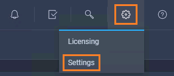
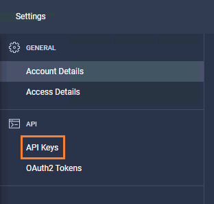
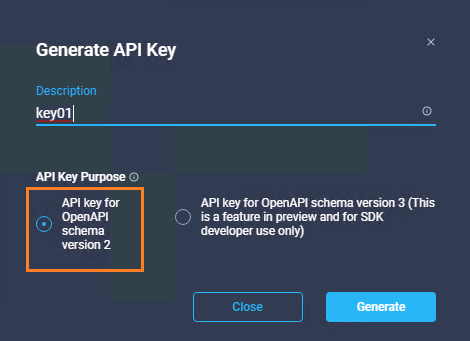
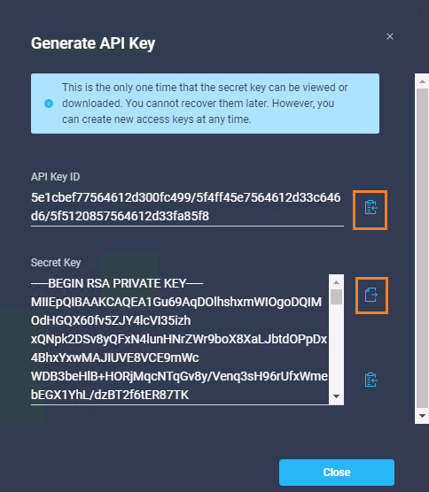
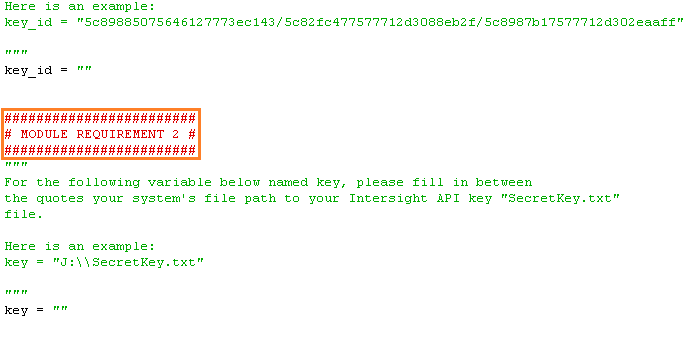
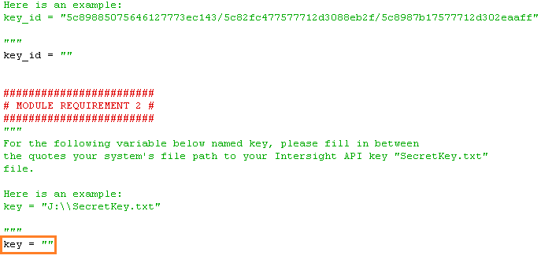

<h1 align="center">Multicast Policy Maker</h1>

<br>
<p align="center">
  
</p>  
<br>
<p align="center">
  The Multicast Policy Maker for Cisco Intersight automates the creation of Multicast Policies.
</p>
<br>

## Features
- Automatically build an Intersight Multicast Policy to your exact specification. Anything that can be done through the Intersight GUI can be done here and more!

- Quickly restore Multicast Policy configurations as part of your on-prem Intersight backup solution.

- Optionally, import into other Python programs or scripts to use the matching named function for easy integration.

- Supported with Intersight SaaS, Connected Virtual Appliance, and Private Virtual Appliance.

## Prerequisites
1. Python 3.7 or higher installed, which can be downloaded from [https://www.python.org/downloads/](https://www.python.org/downloads/).
    - If you're installing for the first time on Windows, select the option **"Add Python 3.x to PATH"** during the installation.
2. Install the Cisco Intersight SDK for Python by running the following command:
   ```
   pip install intersight
   ```
   More information on the Cisco Intersight SDK for Python can be found at [https://github.com/ciscodevnet/intersight-python](https://github.com/ciscodevnet/intersight-python).
3. [_Optional_] If you already have the Cisco Intersight SDK for Python installed, you may need to upgrade. An upgrade can be performed by running the following command:
   ```
   pip install intersight --upgrade --user
   ```
4. Clone or download the Cisco IMM Automation Tools repository by using the  link on the main repository web page or by running the following command from the target directory if Git is locally installed:
    ```
    git clone https://github.com/ugo-emekauwa/cisco-imm-automation-tools
    ```
   If you are downloading the repository file as a zipped file, unzip the file once the download has completed.
5. Generate a version 3 or version 2 API key from your Intersight account.

    **(a).** Log into your Intersight account, click the Settings icon and select **Settings**.
    
      
      
    **(b).** Under the API section in the work pane, click **API Keys**.
    
      
      
    **(c).** In the API Keys section in the work pane, click the **Generate API Key** button.
    
      
      
    **(d).** In the Generate API Key window, enter a description or name for your API key.
    
      
      
    **(e).** In the Generate API Key window, under API Key Purpose, select a version 3 or version 2 API key.
    
      
      
    **(f).** In the Generate API Key window, click the **Generate** button.
    
      
      
    **(g).** In the Generate API Key window, a new API key will be generated. Copy the API Key ID and download the Secret Key to a secure location.
    
      

## How to Use
1. Please ensure that the above [**Prerequisites**](https://github.com/ugo-emekauwa/cisco-imm-automation-tools#prerequisites) have been met.
2. Within the unzipped Cisco IMM Automation Tools repository, navigate to the folder \src\policy_makers\multicast_policy_maker.
3. Edit the multicast_policy_maker.py file to set the **`key_id`** variable using the following instructions:

    **(a).** Open the multicast_policy_maker.py file in an IDLE or text editor of choice.
    
    **(b).** Find the comment **`# MODULE REQUIREMENT 1 #`**.
     
      
      
    **(c).** Underneath, you will find the variable **`key_id`**. The variable is currently empty.
    
      
      
    **(d).** Fill in between the quotes of the **`key_id`** variable value with the ID of your API key. For example:
      ```py
      key_id = "5c89885075646127773ec143/5c82fc477577712d3088eb2f/5c8987b17577712d302eaaff"
      ```
4. Edit the multicast_policy_maker.py file to set the **`key`** variable using the following instructions:

    **(a).** Open the multicast_policy_maker.py file in an IDLE or text editor of choice.
    
    **(b).** Find the comment **`# MODULE REQUIREMENT 2 #`**.
    
      
      
    **(c).** Underneath, you will find the variable **`key`**. The variable is currently empty.
    
      
      
    **(d).** Fill in between the quotes of the **`key`** variable value with your system's file path to the SecretKey.txt file for your API key. For example:
      ```py
      key = "C:\\Keys\\Key1\\SecretKey.txt"
      ```
5. Edit the multicast_policy_maker.py file to set all the configuration variable values using the following instructions:

    **(a).** Open the multicast_policy_maker.py file in an IDLE or text editor of choice.

    **(b).** Find the comment **`# MODULE REQUIREMENT 3 #`**.
    
      
      
    **(c).** Underneath, you will find the instructions to edit the configuration variable values to match your environment. Each variable has a sample value for ease of use. The variable values to edit begin under the comment **`####### Start Configuration Settings - Provide values for the variables listed below. #######`**.
      
      
   
    Completion of editing the configuration variable values is marked by the comment **`####### Finish Configuration Settings - The required value entries are complete. #######`**.
      
      
6. Save the changes you have made to the multicast_policy_maker.py file.
7. Run the multicast_policy_maker.py file.

## Where to Demo
The Multicast Policy Maker can be demoed on Cisco dCloud in the following content:

1. [**_Cisco Intersight Mode with UCS X-Series v1 - Instant Demo_**](https://dcloud2-rtp.cisco.com/content/instantdemo/cisco-intersight-mode-with-ucs-x-series-v1-instant-demo-2)
2. **_Cisco Intersight Mode with UCS X-Series Lab v1 - Scheduled Demo/Sandbox_** - Coming soon!

dCloud is available at [https://dcloud.cisco.com](https://dcloud.cisco.com), where Cisco product demonstrations and labs can be found in the Catalog.

## Author
Ugo Emekauwa

## Contact Information
uemekauw@cisco.com or uemekauwa@gmail.com
